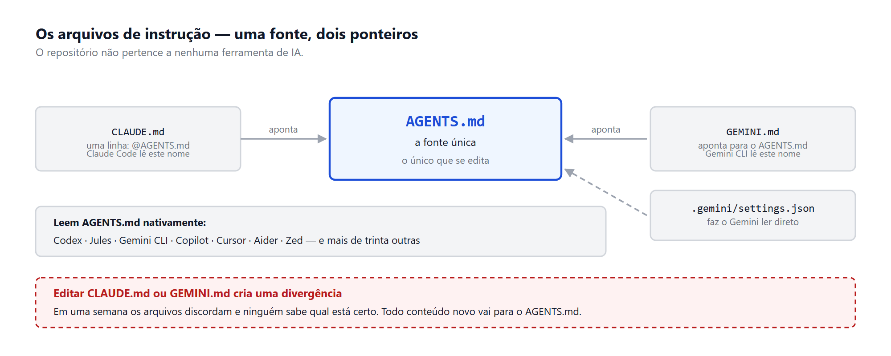
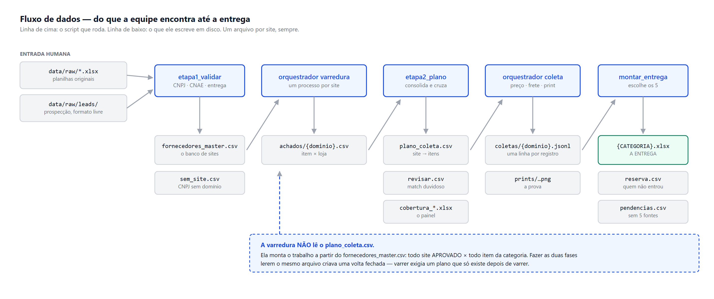
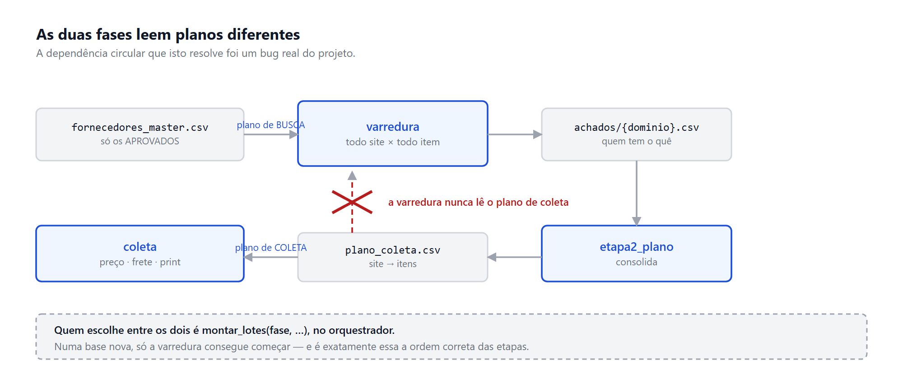
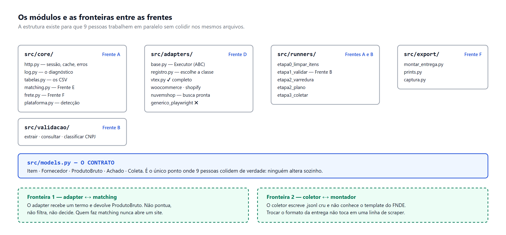

# Estrutura do Repositório — sul-scrapers

Documento de referência da organização do repositório. Conferido contra o código em 19/09/2026 — cada árvore, módulo e caminho aqui foi lido do disco, não reconstruído de memória.

## 1. O repositório não pertence a nenhuma ferramenta

Parte da equipe usa Claude, parte usa ChatGPT, parte usa Gemini. Isso não é um problema a resolver — é uma condição do projeto, e o repositório precisa funcionar assim desde o primeiro commit.

O risco concreto de ignorar isso: alguém escreve as convenções num arquivo que só uma ferramenta lê, e metade da equipe trabalha sem contexto nenhum. O resultado aparece duas semanas depois, em código que não segue o contrato de dados e ninguém sabe por quê.

A solução é um arquivo único que praticamente todas as ferramentas leem, e ponteiros de uma linha para as que insistem em ter o seu próprio nome.

Um princípio que vale repetir: nada neste repositório depende de qual assistente a pessoa usa. Os scripts rodam por linha de comando, as convenções estão em Markdown, e o único requisito é Python 3.11+. Um integrante que não use assistente nenhum consegue trabalhar normalmente.

## 2. Os arquivos de instrução

AGENTS.md é a fonte única. É um formato aberto, mantido pela Agentic AI Foundation sob a Linux Foundation, e mais de trinta ferramentas o leem — Codex, Jules, Gemini CLI, Copilot, Cursor, Aider, Zed, entre outras. Dois assistentes leem outro nome, e para esses existe um ponteiro.

| Arquivo | Linhas | Para que serve |
|---|---|---|
| AGENTS.md | 270 | Todo o conteúdo. O único que se edita. |
| CLAUDE.md | 6 | Uma linha: @AGENTS.md. O Claude Code lê CLAUDE.md e não AGENTS.md |
| GEMINI.md | 9 | Aponta para o AGENTS.md. O Gemini CLI lê GEMINI.md por padrão |
| .gemini/settings.json | 5 | Faz o Gemini CLI ler AGENTS.md direto, sem passar pelo ponteiro |

A regra que evita o problema clássico: se você editar CLAUDE.md ou GEMINI.md, você criou uma divergência. Em uma semana os dois arquivos discordam e ninguém sabe qual está certo. Todo conteúdo novo vai para AGENTS.md.



*Uma fonte única e dois ponteiros. Editar CLAUDE.md ou GEMINI.md cria uma divergência que ninguém percebe até os arquivos discordarem.*

### O que vai dentro do AGENTS.md

Não é um resumo do projeto — para isso existe o guia da equipe. É o conjunto de coisas que um assistente precisa saber para não escrever código errado:

- As regras invioláveis (CNAE 46, site como unidade de execução, coleta separada da montagem)
- O contrato de dados, resumido do models.py, com o aviso de que o arquivo é a fonte real
- O fluxo de arquivos entre as etapas, e por que varredura e coleta leem planos diferentes
- As regras de matching, inclusive o que faz uma divergência de medida ou embalagem reprovar
- A política de cache por fase, as convenções de código e os limites de rate limit
- Como rodar os testes
Um detalhe que importa e é contraintuitivo: arquivo grande piora o resultado. Cada token do AGENTS.md é carregado a cada interação, e pesquisa com repositórios reais indica que arquivos escritos por humanos reduzem bugs de forma significativa, enquanto arquivos inchados ou gerados automaticamente pioram o desempenho e o custo. O arquivo está hoje em 270 linhas, e cresceu ao absorver as regras de matching e de cache. Esse é o teto prático: daqui para cima, o excedente vira documentação em docs/.

## 3. O que cada ferramenta consegue fazer com o repositório

Todas conseguem trabalhar no GitHub. O modo de trabalhar é que muda, e vale a equipe saber qual usar para quê.

| Ferramenta | Como acessa o repositório | Feitio |
|---|---|---|
| Codex (ChatGPT) | Conecta o repo e roda em sandbox na nuvem; devolve o trabalho como pull request. Também tem CLI e extensão de VS Code | Assíncrono. Você descreve a tarefa e volta depois |
| Jules (Google) | Clona o repo numa VM, trabalha sozinho e abre PR | Assíncrono. Bom para tarefa isolada e bem descrita |
| Gemini CLI | Roda no terminal, sobre o clone local | Interativo, no seu computador |
| Claude Code | Terminal, app desktop ou claude.ai/code; local ou conectado ao GitHub | Interativo ou assíncrono |

O que isso significa na prática para o projeto: ninguém fica de fora. Quem usa ChatGPT pede ao Codex para implementar um adapter e revisa o PR. Quem usa Gemini faz o mesmo com Jules. Quem usa Claude trabalha do jeito que já viu. Todos leem as mesmas instruções e produzem PRs para a mesma branch protegida.

### Duas cautelas

Os agentes assíncronos (Codex e Jules) abrem PR sem alguém acompanhar passo a passo. Com main protegida e revisão obrigatória isso é seguro, mas a revisão precisa acontecer de verdade — PR de agente aprovado no automático é como commit direto na main, só que mais difícil de rastrear depois.

E nenhum deles deve receber credencial. O .env, a pasta credentials/ e qualquer token ficam fora do git, no .gitignore. Se um agente precisar rodar algo que exige credencial, quem roda é a pessoa, na própria máquina.

## 4. A árvore de pastas

```
sul-scrapers/
  AGENTS.md              <- o contexto. O UNICO que se edita
  CLAUDE.md              <- ponteiro (@AGENTS.md)
  GEMINI.md              <- ponteiro
  .gemini/settings.json  <- faz o Gemini CLI ler AGENTS.md direto
  README.md              <- porta de entrada: instalacao e comandos
  LEIA-ME-ANTES.md       <- como encaixar este esqueleto no fork
  .gitignore
  pytest.ini             <- pythonpath = . e o marcador "lento"
  requirements.txt

  docs/
    LEIA-ME.md           <- avisa que os dois abaixo sao exportados
    ESTRUTURA.md         <- este documento
    GUIA.md              <- o guia da equipe, exportado do documento

  data/
    raw/                 entradas do projeto e caches
      Lista_Equipamentos_FNDE_-_SUL.xlsx
      base_fornecedores_regiao_sul.xlsx            102 empresas, sem CNPJ
      fornecedores_atacadistas_..._1.xlsx          114 empresas, com CNPJ
      FNDE_output.xlsx                             o template de 15 colunas
      leads/*.csv|xlsx         o que a prospeccao acha, em formato livre
      cnpj/{cnpj}.json         resposta bruta da Receita       (fora do git)
      http_cache/              corpo + .meta.json com a data   (fora do git)
      bloqueadas.csv           site que nos barrou, com data e motivo
      falhas.csv               site que quebrou na execucao
    interim/             o que a equipe compartilha -- VAI pro git
      itens.csv                  132 itens da coleta automatica
      itens_manuais.csv          12 itens da coleta manual
      fornecedores_master.csv    o banco de sites
      sem_site.csv               empresa com CNPJ e sem dominio conhecido
      achados/{dominio}.csv      saida da varredura, um por site
      plano_coleta.csv           site -> itens que ele tem
      revisar.csv                match que precisa de olho humano
      reserva.csv                fornecedores alem dos 5, com o motivo
      pendencias.csv             item/UF que nao fechou 5 fornecedores
    coletas/{dominio}.jsonl      saida da coleta, um por site   (fora do git)
    output/                                                     (fora do git)
      {CATEGORIA}.xlsx           A ENTREGA
      cobertura_{CATEGORIA}.xlsx o painel de cobertura, para humanos
      prints/{CATEGORIA}/{id_item}__{dominio}__{uf}.png
      miniaturas/                JPEG comprimido, o que vai embutido
  logs/execucao.log                                             (fora do git)

  src/
    models.py            O CONTRATO. Ninguem altera sozinho
    orquestrador.py      varredura|coleta --categoria --site --shard --limite
    core/
      http.py            sessao unica: retry, rate limit, cache COM VALIDADE
      log.py             log unico: console + logs/execucao.log
      tabelas.py         le e grava os CSV intermediarios
      plataforma.py      detecta VTEX / Woo / Shopify / ...
      matching.py        normalizacao, medida, embalagem e score
      frete.py           classificar_site() e cotar_produto()
    adapters/
      base.py            Executor (ABC) -- o contrato de todo executor
      registro.py        escolhe o executor pela plataforma detectada
      vtex.py  woocommerce.py  shopify.py  nuvemshop.py
      generico_playwright.py
    validacao/           extrair_cnpj  consultar_cnpj  classificar_cnae
    runners/             etapa0_limpar_itens  etapa1_validar
                         etapa2_varredura  etapa2_plano  etapa3_coletar
    export/
      montar_entrega.py  le data/coletas/, escreve data/output/
      prints.py          miniatura + hyperlink na coluna PRINT
      captura.py         o print: abre a pagina, preenche o CEP, fotografa

  tests/
    conftest.py          fixtures comuns e o Cliente falso
    loja_falsa.py        uma loja VTEX servida em localhost
    fixtures/            JSON salvo, para testar offline
    test_*.py            171 testes
```

Quatro observações sobre esta árvore.

As pastas de dados são versionadas mas quase vazias. Cada uma tem um .gitkeep, porque o git não versiona diretório vazio. Sem isso, quem clonar o repo recebe erro de pasta inexistente na primeira execução.

data/interim/ é a única pasta de dados que entra no git. Os CSVs intermediários são pequenos e a equipe inteira depende deles — é como a pessoa que está no adapter sabe quais fornecedores foram aprovados sem precisar rodar a Etapa 1 na própria máquina.

cobertura_{CATEGORIA}.xlsx leva prefixo de propósito. {CATEGORIA}.xlsx é a entrega final, gerada pelo montador; a cobertura é o painel gerado pela Etapa 2. São coisas diferentes, e com o mesmo nome uma sobrescreveria a outra no meio do prazo.

Os runners não são todos executáveis. etapa0, etapa1 e etapa2_plano rodam sozinhos pela linha de comando; a varredura e a coleta rodam pelo orquestrador, que é quem agrupa o trabalho por domínio e abre um processo por site. Chamar etapa2_varredura direto não funciona, e é de propósito: fora do orquestrador não existe a garantia de um processo por domínio, que é o que sustenta o rate limit.

### Os comandos que existem de verdade

```
# Etapa 0 -- limpar a lista de itens (ja rodada; o resultado esta versionado)
python -m src.runners.etapa0_limpar_itens

# Etapa 1 -- validar fornecedores
python -m src.runners.etapa1_validar              # reaproveita CNPJ ja consultado
python -m src.runners.etapa1_validar --com-frete  # tambem testa os 3 CEPs (lento)
python -m src.runners.etapa1_validar --do-zero    # reconsulta tudo

# Etapa 2 -- varredura e plano
python -m src.orquestrador varredura --categoria UTENSILIOS --limite 10
python -m src.orquestrador varredura --categoria UTENSILIOS --shard 1/3
python -m src.runners.etapa2_plano

# Etapa 3 -- coleta de preco, frete e print
python -m src.orquestrador coleta --categoria UTENSILIOS --shard 1/3

# Montar a entrega
python -m src.export.montar_entrega --entrada data/coletas/ --saida data/output/

# Testes
pytest -m "not lento"    # segundos
pytest                   # inclui o fluxo completo com navegador (~2 min)
```

## 5. Como os dados atravessam as pastas

O repositório tem uma regra de ouro que explica quase toda a estrutura: um arquivo por site na entrada, um arquivo por site na saída, e scripts de junção que leem pastas inteiras. Nenhum arquivo é escrito por mais de um processo ao mesmo tempo.

É isso que permite rodar oito sites em paralelo, ou três máquinas com --shard, sem lock e sem coordenação.

A escrita é atômica onde importa: os CSV compartilhados são gerados num arquivo temporário e trocados no fim, para que uma interrupção no meio não deixe o arquivo pela metade. O .jsonl da coleta é a exceção deliberada — ele é gravado linha a linha, conforme coleta, porque a retomada depende de o que já está no disco ser verdade.



*O caminho completo dos dados: cada script e o arquivo que ele escreve. Um arquivo por site na entrada e na saída.*

### As duas fases leem planos diferentes

A varredura descobre quem vende o quê; a coleta usa essa descoberta. Elas não podem ler o mesmo arquivo, senão nenhuma roda numa base nova — foi um problema real do projeto, e a separação é o que o resolve.

| Fase | Lê | Produz |
|---|---|---|
| etapa1_validar | data/raw/ (as duas bases) + data/raw/leads/ (formato livre) | fornecedores_master.csv, sem_site.csv |
| varredura | fornecedores_master.csv — todo site APROVADO × todo item da categoria | achados/{dominio}.csv |
| etapa2_plano | achados/*.csv + fornecedores_master.csv | plano_coleta.csv, revisar.csv, cobertura_*.xlsx |
| coleta | plano_coleta.csv (quais itens) + achados/{dominio}.csv (a URL) | coletas/{dominio}.jsonl + prints/ |
| montar_entrega | coletas/*.jsonl + itens.csv + fornecedores_master.csv | {CATEGORIA}.xlsx, reserva.csv, pendencias.csv |



*Por que varredura e coleta não podem ler o mesmo arquivo.*

### A entrada humana: data/raw/leads/

Há um ponto do fluxo em que a entrada não é gerada por script nenhum: o que a prospecção encontra. Essa pasta existe para isso, e a regra dela é ao contrário das outras — em vez de exigir um layout, ela se adapta ao que vier.

Qualquer .csv ou .xlsx, quantos arquivos quiser, primeira aba, com as colunas no nome que a pessoa preferir. ler_leads() descobre as colunas por sinônimo, comparando palavra a palavra sem acento:

| Campo | Sinônimos aceitos | Obrigatório |
|---|---|---|
| site | site, url, dominio, link, endereco, pagina, website, webpage, portal, ecommerce | SIM |
| nome | nome, empresa, fornecedor, razao, estabelecimento | não |
| uf | uf, estado | não |
| cnpj | cnpj | não |

Basta a palavra aparecer no nome da coluna: "Site Oficial", "Link (clicável)", "URL do site" e "Site / domínio" casam todos. Nome idêntico a um sinônimo ganha de nome que apenas o contém, para que "Site" e "Site do fabricante" não dependam da ordem das colunas.

Arquivo sem nenhuma coluna de site levanta PlanilhaSemColunaDeSite, nomeando o arquivo, as colunas que ele tem e as que se esperava — e o erro junta todos os arquivos problemáticos de uma vez, para não descobrir um por rodada. Isso é deliberado: antes, coluna com outro nome produzia zero fornecedores sem erro nenhum, e quem rodava a etapa ia procurar defeito no CNPJ ou na rede.

Lead nunca sobrescreve o que as duas bases já resolveram. Ele só preenche buraco (nome ou UF em branco) e acrescenta domínio novo; decisão humana de reprovação sobrevive a qualquer releitura. Todo lead entra como PENDENTE, e quem decide é o pipeline de CNPJ.

### O cache tem validade, e a validade muda com a fase

Toda resposta HTTP é gravada em disco — ela é prova do que o site respondeu naquele instante, não só economia de rede. O que muda é por quanto tempo ela pode ser reaproveitada:

| Fase | Construtor | Validade |
|---|---|---|
| varredura | Cliente.para_varredura() | 7 dias — reprocessar o parser é barato |
| coleta | Cliente.para_coleta() | nenhuma — sempre busca de novo |

O motivo: preço, estoque e frete entram na entrega com a data da coleta ao lado e um print tirado na hora. Um corpo guardado de outro dia faria a planilha discordar da própria prova. A variável de ambiente SUL_SCRAPERS_CACHE_TTL sobrepõe os dois.

### O que entra no git e o que não entra

| Pasta | No git? | Por quê |
|---|---|---|
| data/raw/ planilhas | Sim | São a entrada do projeto, pequenas e imutáveis |
| data/raw/leads/ | Sim | É como a prospecção entrega o que achou para a Etapa 1 |
| data/raw/cnpj/ e http_cache/ | Não | Cache regenerável, cresce rápido |
| data/raw/bloqueadas.csv, falhas.csv | Sim | Registro de execução que o grupo precisa ver |
| data/interim/ | Sim | É como a equipe compartilha estado entre as etapas |
| data/coletas/ | Não | Regenerável, e cresce muito |
| data/output/ | Não | São os entregáveis; vão zipados, não versionados |
| logs/ | Não | Log de execução não é dado do projeto |
| credentials/, .env | Nunca | Sessões de navegador e segredos |

A decisão de versionar data/interim/ é a menos óbvia e a mais útil. Sem ela, quem está escrevendo um adapter precisaria rodar a Etapa 1 inteira só para ter uma lista de fornecedores com que testar. Com ela, dá um git pull e o estado atual do projeto está ali.

O efeito colateral: quem roda um runner e gera um CSV novo precisa commitar. Se a Etapa 1 aprovou doze fornecedores novos e ninguém subiu o fornecedores_master.csv, o resto da equipe continua trabalhando com a lista velha.

## 6. Os módulos e quem mexe em quê

A estrutura foi desenhada para que nove pessoas trabalhem em paralelo sem colidir. O jeito de conseguir isso é fazer com que as frentes toquem arquivos diferentes.

| Arquivo | Quem mexe | Quem só lê |
|---|---|---|
| models.py | Integração (frente A), com aviso ao grupo | Todos |
| validacao/* | Frente B (CNPJ) | — |
| adapters/vtex.py etc. | Frente D, um arquivo por pessoa | — |
| core/matching.py | Frente E | — |
| core/frete.py, export/* | Frente F | — |
| core/http.py, core/log.py, core/tabelas.py, orquestrador.py | Frente A | Todos |
| tests/ | Quem escreve o código testado | Todos |



*Quem mexe em quê, e as duas fronteiras que permitem nove pessoas em paralelo sem colidir.*

Duas fronteiras que sustentam essa divisão:

Quem escreve adapter não sabe o que é matching. O adapter recebe um termo e devolve uma lista de ProdutoBruto — uma por VARIAÇÃO, não por produto, porque é a variação que carrega a medida e o preço. Não pontua, não filtra, não decide nada. Quem escreve matching recebe ProdutoBruto e nunca abre um site. Os dois testam contra o mesmo tipo, e nenhum precisa esperar o outro.

Quem coleta não sabe o que é o template do FNDE. O coletor escreve .jsonl cru; o montador lê a pasta e monta as planilhas. Trocar o formato de entrega não toca em uma linha de scraper.

### O contrato: cinco dataclasses, não duas

models.py define Item, Fornecedor, ProdutoBruto, Achado e Coleta. Três pontos que já causaram erro e valem destaque:

- id_item é str, nunca int. O ID FGV mistura "1" e "33" com "G008", "U029" e "318N" — 96 dos 144 não são números. Converter para int perde dois terços da lista.
- uf é a UF da SEDE e não é critério de nada. Quem aprova ou reprova é entrega_sul, e nele a UF ausente significa "não deu para saber", não "não entrega" — a diferença é o que impede um site fora do ar de ser reprovado por engano.
- ProdutoBruto tem preco e preco_lista. preco é o que se paga; preco_lista é o riscado. A entrega tem coluna para os dois mais a diferença, e ler só um dos campos apaga o desconto.
- Achado tem classificacao (aceito | revisar). Sem ela, o plano de coleta não consegue separar o que foi aprovado do que espera revisão humana — e mandaria os dois para a coleta.
Campos acrescentados depois do congelamento são sempre opcionais, com padrão: nada que já existia mudou de nome ou de tipo.

### O arquivo perigoso

models.py é o único ponto onde nove pessoas colidem de verdade. Se alguém renomear um campo, todo o resto quebra em silêncio — ou pior, roda e grava dado errado.

A regra: congelar no primeiro dia e só alterar com aviso no grupo. Mudança nele não é uma decisão técnica individual, é uma decisão de projeto.

### Estado de cada adapter

O contrato de todo executor é a classe Executor, em adapters/base.py — uma ABC, com buscar(), detalhar(), cotar_frete(), capturar_print(), abrir() e fechar(). A detecção de plataforma não mora no adapter: ela está em core/plataforma.py, e quem escolhe a classe é adapters/registro.py.

| Adapter | Estado | O que falta |
|---|---|---|
| vtex.py | Completo: busca por SKU, seller com estoque, ListPrice/Price, simulação de frete | Confirmar os endpoints contra uma loja real do nosso conjunto |
| woocommerce.py | Busca implementada (Store API) | detalhar() e conferir os nomes de campo contra uma loja real |
| shopify.py | Busca implementada (suggest.json + /products/{handle}.js) | Conferir contra uma loja real |
| nuvemshop.py | Busca implementada (JSON-LD do HTML da busca) | Conferir contra uma loja real; tema antigo pode não emitir JSON-LD |
| generico_playwright.py | Esqueleto: abrir() e buscar() levantam NotImplementedError | Depende de portar o setup_sessao.py do repo de referência |

O print é a exceção que vale citar: ele não é responsabilidade de cada adapter. src/export/captura.py abre a página, preenche o CEP e fotografa, e Executor.capturar_print() usa isso por padrão — inclusive nos adapters de API, porque o solicitante confere imagem, não JSON. Adapter cujo campo de CEP a heurística não acha sobrescreve SEL_CAMPO_CEP e SEL_RESULTADO_FRETE, e nada mais.

## 7. Testes

São 171 testes, e nenhum deles toca a rede de verdade.

```
pytest -m "not lento"   # 162 testes, ~4 s
pytest                  # inclui o fluxo completo com navegador (~2 min)
pytest -m lento         # so o fluxo completo
```

tests/loja_falsa.py é uma loja VTEX servida em localhost, hostil de propósito nos pontos em que o pipeline já errou: o primeiro SKU é a unidade avulsa quando o item pede o kit, o primeiro seller está sem estoque e mais caro, o preço tem riscado, e o frete muda nos três CEPs. É contra ela que roda o teste de ponta a ponta — varredura, plano, coleta nas três UFs, Excel e prints.

Os testes marcados como lento abrem um Chromium de verdade. Quem não tiver o navegador instalado vê esses pulados, não quebrados: pip install playwright && playwright install chromium resolve.

## 8. Branches, PR e commits

main protegida. Todo trabalho em branch, todo merge por PR com pelo menos uma revisão. Com nove pessoas na mesma semana, commit direto na main custa mais tempo do que economiza — e com agentes assíncronos abrindo PR, a proteção deixa de ser formalidade.

Nome da branch por frente e assunto:

```
etapa1/extracao-cnpj
etapa2/adapter-vtex
etapa3/frete-vtex
dados/lista-equipamentos-limpa
```

Commit em português, no imperativo, dizendo o que muda e não o que foi feito: adiciona adapter VTEX, corrige digito verificador do CNPJ, atualiza fornecedores_master com 12 aprovados.

### PR de agente

Codex e Jules abrem PR sozinhos. Duas regras a mais para esses:

- O PR precisa dizer qual ferramenta o gerou, no título ou no corpo. Quando algo estranho aparecer três dias depois, isso encurta muito a investigação.
- Quem pediu a tarefa é quem revisa, e revisa de verdade. Ninguém conhece a intenção melhor que quem escreveu o prompt.

### Conflito em data/interim/

Vai acontecer: duas pessoas rodam a Etapa 1 e as duas geram fornecedores_master.csv. Como é CSV, o git mostra conflito linha a linha e resolver na mão é tentador — e errado, porque as duas versões podem ter linhas válidas diferentes.

O certo é descartar as duas, rodar o runner de novo com a entrada atualizada e commitar o resultado. O arquivo é gerado, não escrito: quem manda é o script. A Etapa 1 reaproveita os CNPJ já consultados, então rodar de novo é barato; --do-zero força a reconsulta.

## 9. O que veio do fork, e o que ainda não veio

O src/ é novo — não é uma refatoração do scraper/ que veio de giuprofilo/mercados-scraper. O código herdado era voltado a alimentos e a outro fluxo (SQLite como store principal, sincronização com Google Sheets). Hoje o repositório está limpo: não há scraper/ nem exports/, e o requirements.txt já é o nosso.

Duas utilidades do repo de referência continuam sem porte, e uma delas bloqueia um adapter:

| Arquivo de lá | Para que serve aqui | Situação |
|---|---|---|
| scraper/setup_sessao.py | Salva sessão e CEP por site com launch_persistent_context, sem disparar anti-bot | Não portado. É o que falta para generico_playwright.abrir() sair do NotImplementedError |
| scraper/debug_inspecionar.py | Salva o HTML renderizado de uma URL; use antes de escrever qualquer seletor novo | Não portado. Enquanto isso, src/export/captura.py já cobre abrir página, preencher CEP e fotografar |

O aviso do README original continua valendo e vale repetir: mesma plataforma não garante mesmos seletores. Sempre confirme com HTML real.

### Pendências conhecidas do repositório

- Os três adapters não-VTEX (Woo, Shopify, Nuvemshop) foram escritos contra a documentação das plataformas, não contra uma loja nossa. A regra do projeto é salvar uma resposta real em tests/fixtures/ antes de confiar nos nomes de campo.
- SUBCLASSES_AUTOPECAS_ATACADO, em validacao/classificar_cnae.py, está vazia de propósito: os 2 itens de PNEU precisam de distribuidora com CNAE do grupo 4530-7, e quais subclasses contam como atacado precisa ser conferido na tabela oficial do CNAE. Não chute os códigos.
- Os 20 pares item-produto rotulados à mão, que o guia da equipe pede para calibrar o matching, ainda não existem em tests/fixtures/. Os testes de matching hoje usam casos derivados dos itens reais 294, 313, 306 e U053.
- Os dois documentos de docs/ são exportações: se alguém editar o original no documento compartilhado, os .md ficam defasados. Reexporte junto, como o docs/LEIA-ME.md avisa.
